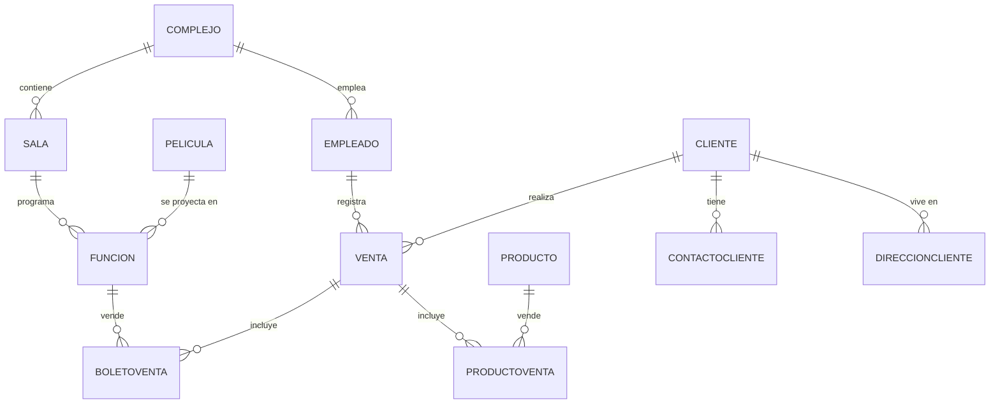

# Evidencia Integradora – CINE+

## Portada
**Equipo Integradora 2 Tipo B**  
Materia: Base de Datos  
Maestra: Rosa Iliana Fuentes Cruz
TeamMC integrantes: 
⌁ Delgado Cerros Rodrigo Daniel
⌁ García Sánchez Diego Emmanuel
Fecha: Julio 2025  

## Introducción
El presente documento describe el proceso completo de diseño e implementación de la base de datos para la cadena de cines **CINE+**.  
Se parte de un análisis del problema, se identifican entidades, se modela la solución mediante un Diagrama Entidad‑Relación y se normaliza el modelo relacional.  
Posteriormente se desarrollan los scripts SQL necesarios para crear la base de datos, insertar datos de ejemplo, generar consultas, vistas, procedimientos almacenados y triggers, satisfaciendo los requerimientos de la práctica integradora.

## Análisis de la situación
CINE+ opera más de 120 complejos en México y requiere optimizar la administración de personal, clientes, inventario de dulcería y funciones de cine. Las necesidades incluyen:  
- **Administración de empleados** (datos personales, asistencias, ventas).  
- **Gestión de clientes** (contactos, direcciones, membresías y promociones).  
- **Control de funciones** (salas, horarios, restricciones).  
- **Inventario y ventas** de productos de dulcería y promocionales.  
- **Reportes gerenciales** sobre ventas, clientes y promociones.

## Definición del problema
> Diseñar e implementar una base de datos que centralice y normalice la información necesaria para las operaciones de CINE+, permitiendo consultas y procesos automatizados que mejoren la eficiencia operativa y la toma de decisiones.

## Diseño de la base de datos



### Modelo relacional normalizado (3FN)
| Tabla | PK | FK | Descripción |
|-------|----|----|-------------|
| **Complejo** | id_complejo | – | Sucursales de CINE+ |
| **Sala** | id_sala | id_complejo | Salas asociadas a un complejo |
| **Empleado** | id_empleado | id_complejo | Personal que atiende complejos |
| **Cliente** | id_cliente | – | Clientes registrados |
| **ContactoCliente** | id_contacto | id_cliente | Teléfonos y correos (N:1) |
| **DireccionCliente** | id_direccion | id_cliente | Direcciones (N:1) |
| **Pelicula** | id_pelicula | – | Películas disponibles |
| **Funcion** | id_funcion | id_sala, id_pelicula | Proyecciones en salas |
| **Producto** | id_producto | – | Alimentos y promocionales |
| **Venta** | id_venta | id_cliente, id_empleado, id_complejo | Transacciones |
| **BoletoVenta** | id_detalle | id_venta, id_funcion | Boletos dentro de una venta |
| **ProductoVenta** | id_detalle | id_venta, id_producto | Productos dentro de una venta |

### Diccionario de datos (fragmento)

| Columna | Tipo | Tabla | Descripción |
|---------|------|-------|-------------|
| id_complejo | INT PK | Complejo | Identificador único del complejo |
| nombre | VARCHAR(100) | Complejo | Nombre comercial del complejo |
| ciudad | VARCHAR(100) | Complejo | Ciudad donde se ubica |
| ... | ... | ... | ... |
| id_funcion | INT PK | Funcion | Identificador de la función |
| fecha_funcion | DATE | Funcion | Día de la proyección |
| hora_inicio | TIME | Funcion | Hora de inicio |
| hora_fin | TIME | Funcion | Hora de término |
| precio_boleto | DECIMAL(6,2) | Funcion | Precio unitario |

*(El diccionario completo se detalla en el archivo fuente SQL.)*

## Diseño lógico
Los scripts se dividen para facilitar mantenimiento:

| Nº | Archivo | Contenido |
|----|---------|-----------|
| 1 | 1_create_db.sql | Creación de BD, tablas e inserción de registros |
| 2 | 2_queries_views.sql | Consultas y vistas solicitadas |
| 3 | 3_procedures.sql | Procedimientos almacenados con validaciones |
| 4 | 4_procedure_calls.sql | Ejemplos de llamadas a procedimientos |
| 5 | 5_triggers.sql | Triggers de control de inventario |

## Ejecución
```
mysql -u usuario -p < 1_create_db.sql
mysql -u usuario -p cineplus < 2_queries_views.sql
mysql -u usuario -p cineplus < 3_procedures.sql
mysql -u usuario -p cineplus < 5_triggers.sql
```
Posteriormente puede probar con:  
```sql
USE cineplus;
SOURCE 4_procedure_calls.sql;
```

---

